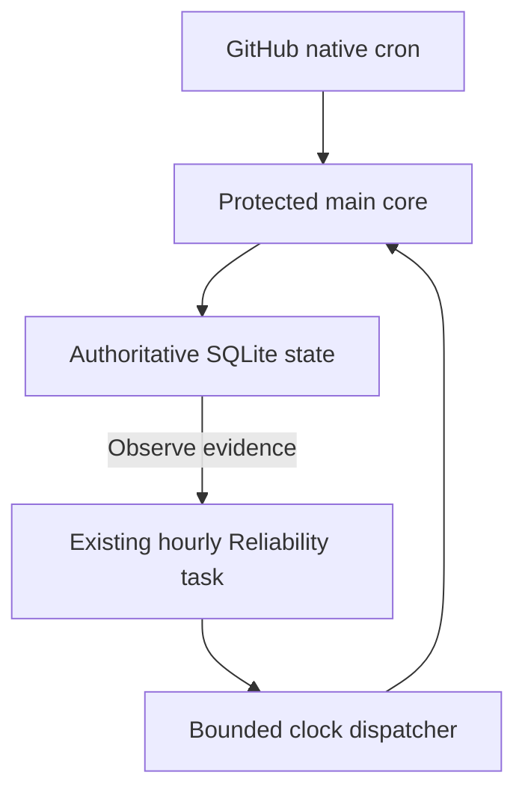

# Portfolio Brain scheduler repair evidence

Protected main: `8a47ce9f04f77c2c4ab4c972106ccd31bb1c97e9` ([merged PR648](https://github.com/P00NSMASHER/portfolio-brain/pull/648)).

| Requirement | Status | Evidence |
|---|---|---|
| Protected integration | PASS | Exact head2070aac0e1a457061bb1b8fbb229b430962351b6; both required App-bound checks |
| Regression tests | PASS | 1414 local tests;45 targeted; actual main Foundation [37711517338](https://github.com/P00NSMASHER/portfolio-brain/actions/runs/37711517338) successful |
| Real clock-to-core demonstration | PASS | Manual clock [37711545775](https://github.com/P00NSMASHER/portfolio-brain/actions/runs/37711545775) -> core [37711557264](https://github.com/P00NSMASHER/portfolio-brain/actions/runs/37711557264); all core steps successful |
| State correctness | PASS | Seq49, pending_events0, hosted doctor PASS; immutable state41d43fcc25f563df95a917a7327e7f3c07d515da independently replayed to matching canonical hash |
| Native GitHub cron delivery | BLOCKED | No actual rebuilt schedule events yet; earlier missing deliveries retained |
| Recurring external automatic delivery | NOT TESTED | Hourly existing Reliability worker enabled; manual_probe excluded |
| Two-hour soak/postvalidation | NOT TESTED | Cannot start until real automatic baseline and all fresh gates pass |
| Unlimited self-repair/nonstop guarantee | FAIL | No such guarantee implemented or demonstrated |
| Real revenue/engineering savings/private live ingestion/live knowledge merge | NOT TESTED | No fabricated product results |

[Current receipt](acceptance/finish-soak.json). [Preserved original blocked exact-source attempt](acceptance/history/e2d825d-native-clock-blocked.json). Manual proof did not start or complete a soak.

Actual core [artifact ZIP](acceptance/clock-fix/artifact.zip), API artifact11522091959, SHA256 `6623e19f539c20b35fb8c7332c3f1b1fee129394bd70000bc6b076056c2ef3a7` verified after download. [Clock provenance](acceptance/clock-fix/artifact/clock.json), [delivery](acceptance/clock-fix/artifact/delivery.json), [hosted doctor](acceptance/clock-fix/artifact/doctor/report.json), [independent replay doctor](acceptance/clock-fix/independent-doctor/report.json). Delivered SQLite SHA256 `e2af96f60d32210dd8c70b4421b5b6a1d63afa0d6f08a09738f82c54a2ea75d4`. Canonical hash `f1d2c2183f641f64792fff98dc6599d2c83b6b64255cbcda51387c782749ea15`.

Superseded candidate inventory failure is preserved at [37711065270](https://github.com/P00NSMASHER/portfolio-brain/actions/runs/37711065270); diagnosed before the corrected candidate. No checks or historical data deleted.

The clock uses the existing connection and repo token, one automatic signal per UTC slot, immutable provenance, current-main binding, twenty-minute receipt validity and no direct main/state writes. [Architecture](https://github.com/P00NSMASHER/portfolio-brain/blob/main/docs/rebuild/ARCHITECTURE.md) / [Operations and recovery](https://github.com/P00NSMASHER/portfolio-brain/blob/main/docs/rebuild/OPERATIONS.md).

Acceptance requires three genuine automatically delivered complete cycles on one unchanged main over at least7200seconds, gap<=5400seconds, all mandatory core successes, semantic freshness, verified state lineage, zero backlog, independent final replay and postvalidation. External scheduling must link actual scheduled worker execution, immutable scheduled pulse, successful dispatcher and matching actual core artifact. A manual test or elapsed time cannot pass it. Native cron remains separately blocked until observed. Old issue640 provider run remains unresolved historical evidence and does not gate v2.
