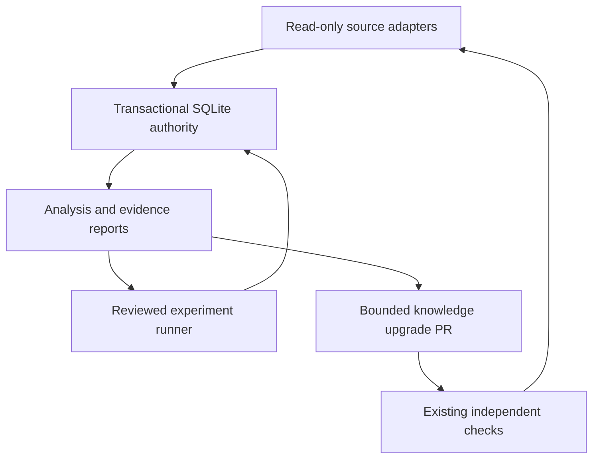

# Portfolio Brain replacement

The product goal is a progressively more useful research and engineering assistant
for a business portfolio: gather information, discover code, learn from measured
outcomes, conduct experiments, and find commercial hypotheses. Financial holdings
analysis is an optional explicitly supplied-input capability, not the primary product.

Three runtime responsibilities: source acquisition, state authority, and intelligence.
Reporting and the reviewed experiment are ordinary library code, not services. One
hourly workflow owns execution. No legacy package, artifact namespace, reducer,
writer lock, agent heartbeat, cost governor, or orphaned-run cleanup is imported by
`brain/`. The existing protected merge verifier is preserved byte-identically.

## State guarantees

- SQLite `BEGIN IMMEDIATE`, full durability, bounded busy timeout, one visibility policy.
- Whole input batches validate before a committed acknowledgement. Identical event IDs
  are no-ops; reused IDs with different content reject the entire batch.
- Pending input is durable. Reduction commits ledger entries and applied dispositions
  together. An interruption rolls the entire drain back; restart reapplies exactly once.
- Every event has a contiguous sequence, source revision, semantic timestamp, data label,
  payload digest, previous digest, and chain digest. Missing/corrupt/ambiguous evidence fails closed.
- Repeated kind/key/semantic-time observations (including different UTC timestamp
  text precision for the same instant) must match on payload, ACTUAL/SIMULATED/
  ESTIMATED classification, and PUBLIC/PRIVATE visibility. Replays from a different code
  revision are allowed only for those identical observed facts. A conflicting label is
  rejected atomically at ingestion and during whole-history ledger replay even when
  a later observation superseded it; no change of event ID can upgrade simulated
  observations into actual evidence. No canonical state history is rewritten.
- Reports replay deterministically from verified events. A self-consistently rehashed
  fabricated report still fails the ledger comparison. Pending input blocks reads.
- Delayed observations remain history and cannot replace newer semantic source facts.
- Report generation time never makes old source data current. Code revision, projection
  sequence, semantic age, current complete workload coverage, and doctor freshness are separate checks.
- Backup uses SQLite's backup API and integrity verification. Git publication uses one
  new commit from a captured state parent, rejects main/parent drift, and never force-pushes.
- Public state rejects private input atomically. Private local state has no automatic publication path.

## Intelligence contracts

The report's `repository_changes` projection compares the two latest distinct
semantic observation times per repository using the verified immutable ledger,
not arrival order or external polling. It reports revision movement and the net
GitHub `open_issues_count` tally (which includes pull requests), and records
check deterioration/recovery only for uniquely named, completed checks observed
on the **same exact revision**. Missing checks, duplicates, pending checks, and
changed revisions never imply recovery or passing coverage. Each comparison
retains its two source references, timestamps and ACTUAL_FRESH/NON_ACTUAL/
HISTORICAL evidence quality. A conflicting historical same-time observation
blocks the projection, even if the newest observation is unambiguous.
These are state differences, not verified technical improvement, commercial
value, root-cause attribution, or authorization to take action. The new
projection needs no new workflow, provider query, database, or service.

Repository checks are observed diagnostics, not proof of useful work. Discovery
inspects actual exact-revision source bytes, verifies Git blob hashes, and records
SHA-256 plus structural test paths. Licenses are metadata without a discovery filter.
No instruction in a README, comment, repository name, or fetched source can grant
mutation authority. Fetched code is never executed.

Reuse ranking explains its integer features: observed tests, matched capability
terms, and bounded implementation size. It is not a probability of usefulness.
Feedback remains explicitly operator-reported unless independently verified by a
future approved adapter. Memory stores observations, outcomes, and experiment history;
there is no claim of model-weight training or general intelligence improvement.

Experiments execute only shipped, reviewed, bounded implementations against explicitly
simulated positive/negative inputs. Duplicate-invoice tuple indexing proves the defined
correctness/operation-count claim only; freight recovery validity, commercial demand,
engineering time savings, and revenue remain unverified. New candidates produce
project-specific evaluation plans, not automatic downstream integrations.

Self-upgrades are limited to a fixed public reuse-knowledge file, with three fresh
actual implementation-and-test sources, no private content, one proposal per week,
and the unchanged Foundation/App gate. Arbitrary generated code repair, automatic
third-party integration, paid reasoning, and customer-facing business operations
are not implemented. Source/API failure recovery and inbox replay are automatic.

Holdings calculations require complete prices, finite nonnegative values, explicit
source permission attestation, UTC semantic times, and aligned historical data.
Missing cost basis means P/L unavailable. Historical results use current quantities
and are labelled fixed-holdings scenarios; no realized performance, annualization
assumption, future estimate, order instruction, or position recommendation is invented.

## Acceptance sequence

PREPARE → EXACT-SHA PREFLIGHT → PRE-ARM → SOAK → POST-SOAK VALIDATION.

Preflight covers state integrity/replay, retrieval validation, experiments, reporting,
privacy, concurrency, interruption, and known stale-state regressions locally. Main
must remain unchanged throughout hosted execution. Live pre-arm additionally requires
all four configured source observations, research, experiment, current doctor PASS,
zero pending events, verified restored/published state and actual run/artifact identities.
The six coverage classes replace the old eight asynchronous workflow dependencies.

An authorized soak must capture its start commit, state parent, every complete cycle
receipt, continuity gaps/failures and source freshness, then run the doctor/replay and
verify final delivery. Elapsed time alone cannot pass it. No soak authorization or
completed soak is implied by an hourly scheduled cycle.

## Requirement classification before integration

| Major requirement | Status | Evidence or limit |
|---|---|---|
| Canonical scope and preservation | PASS | Exact source commits and verified recovery refs; workflow hashes |
| Smaller active architecture | PASS | Three responsibilities; one recurring owner;40 inert workflow archives |
| State integrity, concurrency, restart | PASS | Deterministic and independently written adversarial tests |
| Useful source/knowledge/experiment/report pipeline | PASS locally | Unit/integration tests; live demonstration evidence recorded separately |
| Read-only financial-input analysis | PASS locally | Explicit input calculations; no licensed feed connected |
| Public/private code discovery | PASS implementation | Public live evidence separately; private live access NOT TESTED |
| Commercial value and revenue improvement | NOT TESTED | Hypotheses do not establish demand, revenue, or engineering savings |
| General autonomous code repair/upgrades | BLOCKED | Only bounded knowledge PR upgrades implemented; arbitrary self-repair absent |
| Continuous never-interrupted autonomy | BLOCKED | Hourly GitHub runtime; external continuous host not provisioned |
| Protected GitHub integration | NOT TESTED here | Exact PR/head checks required; see delivery record |
| Exact-main hosted pre-arm | NOT TESTED here | Main-only live cycle must publish and verify doctor/delivery |
| Lengthy soak and post-soak | NOT TESTED | Explicit authorization required; no soak launched |
| Legacy orphan repair | BLOCKED | GitHub run37655516971 remains queued; issue640 stays open |
